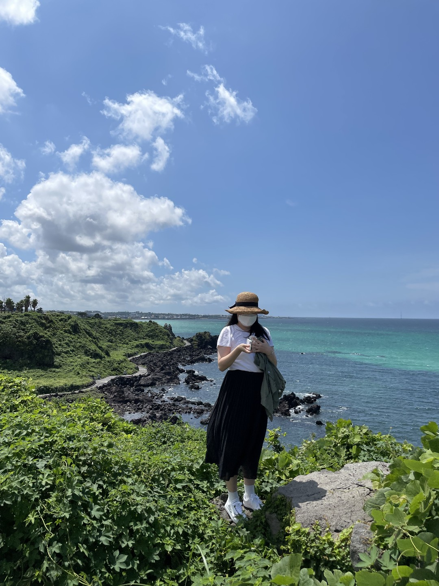
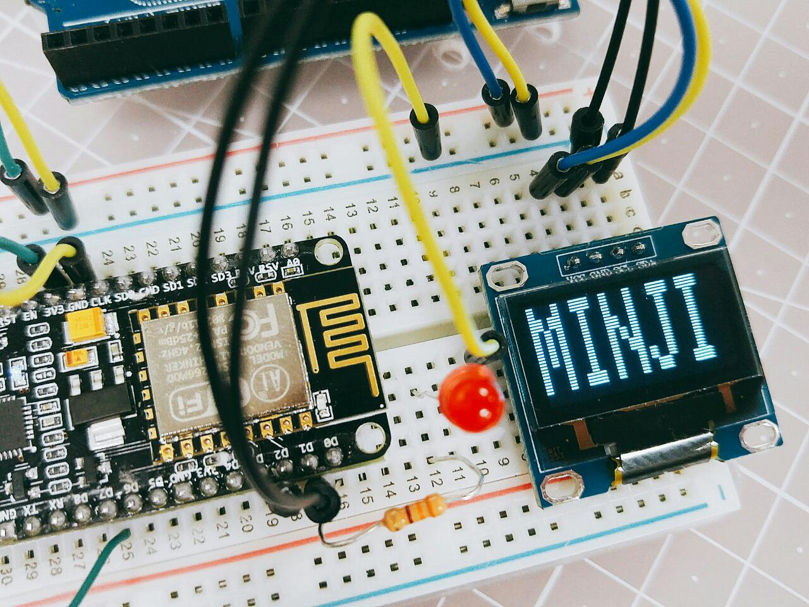

  

<!-- 
 -->
<!--  `2022.09 in Seokchon Lake` -->

<!--  `2022.09 in Seokchon Lake`  | 소프트웨어(컴퓨터공학) & 경제 전공   취미는 드럼, 야구, 스쿼시 <!--   I love computer💻 -->
<!-- --- | --- |  -->

 
**`2022.09 in Seokchon Lake`**

 
  
### 𝐻𝑖 𝑡ℎ𝑒𝑟𝑒 👋
𝙸'𝚖 𝚙𝚜𝚂𝟸𝚖𝚓 🐼💜

 **소프트웨어(컴퓨터공학) & 경제 전공   취미는 드럼, 야구, 스쿼시**
  

  
  
  

  
<!-- 연혁 -->
## 🌳𝐂𝐚𝐫𝐞𝐞𝐫🌳

|         Type          |       Date        | Contents                                  |  Organization   |
| :-------------------: | :---------------: | --------------------------------- | :-------------: |
|   **`🌱Company`**   |     2022.10 ~   (現 재직 중)  | **Software Engineer(디지털개발) - 장기손사**      |    💰    |
|   **`🌱Company`**   |     2021.06 ~ 2022.02  (9개월)    | **Software Engineer(Back-end Developer)**      |    ⚾    |
|   **`📚Education`**  | 2020.01 ~ 2020.12 | **SSAFY(SAMSUNG SW ACADEMY FOR YOUTH) 3기**       |  Samsung  |
|   **`📜Paper`**  | 2018.11 | **[기업 재무제표 데이터와 일별 시계열 데이터를 활용한 기계학습  알고리즘 연구 (A Study on the Machine Learning Algorithm  based on the Financial Time Series Data)](https://www.dbpia.co.kr/journal/articleDetail?nodeId=NODE07608136)**  _2018년 한국지능정보시스템학회 추계학술대회 논문집,  2018.11, 82 - 84 (3 pages)_ ＊주저자 |  한국지능정보 시스템학회 (Korea Intelligent  Information  Systems Society)  |
|   **`📜Paper`**  | 2016.11 | **[기계 학습 기반의 개인 맞춤형 의상 추천 시스템 (Machine Learning  based Fashion Recommendation System for Personal Preference)](https://www.dbpia.co.kr/journal/articleDetail?nodeId=NODE07082985)**  _2016년도 한국통신학회 추계종합학술발표회 논문집,  2016.11, 88 - 89(2 pages)_ ＊공동저자 |  한국통신학회  |
|  **`📚Education`** | 2015.03 ~ 2019.08 | **Bachelor of Science in Engineering (Software and Computer Engineering), Minor(Economics)** | [Ajou Univ.](https://www.ajou.ac.kr/kr/index.do) |

 

## 📚𝐁𝐥𝐨𝐠📚

<!-- badges -->
 𝐃𝐚𝐢𝐥𝐲 𝐁𝐥𝐨𝐠 (𝚍𝚊𝚒𝚕𝚢 𝚕𝚒𝚏𝚎, 𝚏𝚘𝚘𝚍, 𝚝𝚛𝚒𝚙, 𝚐𝚊𝚖𝚎, 𝚑𝚘𝚋𝚋𝚢, 𝚎𝚝𝚌.)
 
 𝐃𝐞𝐯𝐞𝐥𝐨𝐩𝐦𝐞𝐧𝐭 𝐁𝐥𝐨𝐠 (𝚍𝚎𝚟𝚎𝚕𝚘𝚙𝚖𝚎𝚗𝚝, 𝚊𝚕𝚐𝚘𝚛𝚒𝚝𝚑𝚖, 𝚎𝚝𝚌.)
  
 

## 📤𝐎𝐩𝐞𝐧 𝐒𝐨𝐮𝐫𝐜𝐞📤
  

### 𝐂𝐨𝐧𝐭𝐫𝐢𝐛𝐮𝐭𝐢𝐨𝐧𝐬
- [RepoDB.NET#39](https://github.com/mikependon/RepoDB.NET/pull/39)
  
 

## 💾𝐑𝐞𝐜𝐨𝐫𝐝💾

<!-- 백준 티어, Github  -->
<!--  -->

<!--  -->
  

 

